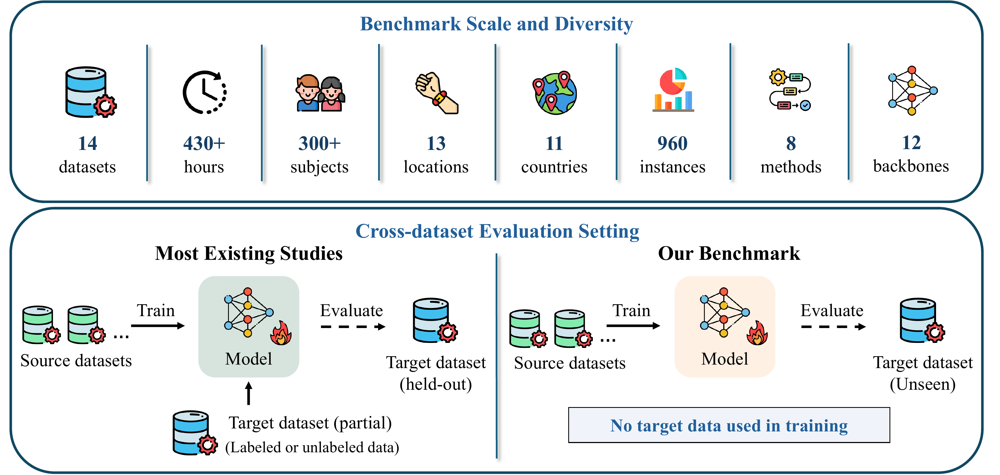

# HAR-Bench

This is the code repository for the paper **HAR-Bench: Benchmarking Self-Supervised Learning for Generalizable Sensor-based Activity Recognition**, a large-scale benchmark for evaluating the generalization capability of self-supervised sensor-based human activity recognition (HAR) models.

<p align="center">
  <a href="assets/framework.png">
    
  </a>
</p>

## 🔍 Key Features

- **Large-scale multi-dataset integration:** Curates and standardizes a large-scale (~258K samples, ~430 hours) sensor-based HAR benchmark that is multi-source (14 widely used datasets), diverse (300+ subjects, 11 countries, 13 body locations, and 2 device types), and multimodal (accelerometer and gyroscope).

- **Cross-dataset generalization benchmark:**  
  - Evaluates four representative self-supervised learning paradigms, including 1 recognition method, 2 reconstruction methods, 3 contrastive methods, and 2 hybrid methods.  
  - Benchmarks 12 architecture combinations consisting of 3 encoders (CNN, ResNet, Transformer) and 4 classifiers (CNN, GRU, MLP, Transformer).

- **Analysis of data scale and domain shift factors:**  
  - Investigates the impact of unlabeled data scale, labeled data scale, and irrelevant activity data scale on generalization performance.  
  - Studies the impact of cross-subject, cross-device, and cross-location domain shifts on generalization performance.

## ⚙️ Installation

Create the environment using `requirements.txt`:

```bash
pip install -r requirements.txt
```

## 📦 Preparing data

### Download

| Dataset   | Country         | # Subject | # Activity | Device   | # Location | Download |
|------------|----------------|-----------:|------------:|-----------|------------:|-----------|
| UCI      | Italy           | 30         | 6           | Custom    | 1 | [Link](https://archive.ics.uci.edu/dataset/341/smartphone+based+recognition+of+human+activities+and+postural+transitions) |
| HHAR       | Denmark         | 9          | 6           | Custom    | 2 | [Link](https://archive.ics.uci.edu/dataset/344/heterogeneity+activity+recognition) |
| Shoaib     | The Netherlands | 10         | 7           | Custom    | 4 | [Link](https://www.utwente.nl/en/eemcs/ps/dataset-folder/sensors-activity-recognition-dataset-shoaib.rar) |
| Motion     | England         | 24         | 6           | Custom    | 1 | [Link](https://github.com/mmalekzadeh/motion-sense) |
| DSADS      | Turkey          | 8          | 18          | Research  | 3 | [Link](https://archive.ics.uci.edu/dataset/256/daily+and+sports+activities) |
| USC-HAD    | United States   | 14         | 12          | Research  | 1 | [Link](https://sipi.usc.edu/had/) |
| KU-HAR     | Bangladesh      | 90         | 18          | Custom    | 1 | [Link](https://www.kaggle.com/datasets/niloy333/kuhar) |
| PAMAP2     | Germany         | 9          | 18          | Research  | 3 | [Link](https://archive.ics.uci.edu/dataset/231/pamap2+physical+activity+monitoring) |
| TNDA-HAR   | China           | 50         | 8           | Research  | 5 | [Link](https://ieee-dataport.org/open-access/tnda-har-0) |
| Mhealth    | Spain           | 10         | 12          | Research  | 2 | [Link](https://archive.ics.uci.edu/dataset/319/mhealth+dataset) |
| WISDM      | United States   | 51         | 18          | Custom    | 2 | [Link](https://archive.ics.uci.edu/dataset/507/wisdm+smartphone+and+smartwatch+activity+and+biometrics+dataset) |
| RealWorld  | Germany         | 15         | 8           | Custom    | 7 | [Link](https://www.uni-mannheim.de/dws/research/projects/activity-recognition/dataset/dataset-realworld/) |
| HARSense   | Meghalaya       | 12         | 6           | Custom    | - | [Link](https://ieee-dataport.org/open-access/harsense-statistical-human-activity-recognition-dataset) |
| UT-Complex | The Netherlands | 10         | 13          | Custom    | 2 | [Link](https://www.utwente.nl/en/eemcs/ps/dataset-folder/ut-data-complex.rar) |

All datasets are publicly available. Please download and extract the datasets into the `datasets/` directory, and name each dataset folder according to the dataset names listed in the table.

### Standardization

Run the following command to standardize all datasets:

```bash
bash scripts/preprocess.sh
```

The preprocessing scripts for each dataset can be found in the `preprocess/` folder.
All datasets are standardized into non-overlapping 6-second windows with a sampling rate of 20 Hz.
More details are provided in the paper.

## 🌍 Cross-dataset Benchmark

### Methods

| Method | Paradigm | Venue | Link |
|--------|-----------|--------|------|
| BioBankSSL | Recognition | npj Digital Medicine 2024 | [Link](https://www.nature.com/articles/s41746-024-01062-3) |
| LIMU-BERT | Reconstruction | SenSys 2021 | [Link](https://dl.acm.org/doi/abs/10.1145/3485730.3485937) |
| CRT | Reconstruction | TNNLS 2023 | [Link](https://ieeexplore.ieee.org/document/10190201) |
| TS-TCC | Contrastive | IJCAL 2021 | [Link](https://www.ijcai.org/proceedings/2021/0324.pdf) |
| TS2Vec | Contrastive | AAAI 2022 | [Link](https://ojs.aaai.org/index.php/AAAI/article/view/20881) |
| FOCAL | Contrastive | NeurIPS 2023 | [Link](https://neurips.cc/virtual/2023/poster/70617) |
| SimMTM | Hybrid | NeurIPS 2023 | [Link](https://proceedings.neurips.cc/paper_files/paper/2023/hash/5f9bfdfe3685e4ccdbc0e7fb29cccf2a-Abstract-Conference.html) |
| CrossHAR | Hybrid | IMWUT 2024 | [Link](https://dl.acm.org/doi/abs/10.1145/3659597) |
### Evaluation

The 14 datasets are partitioned into five dataset-level folds.
Models are trained on four folds and evaluated on the held-out fold.

```bash
bash scripts/run_dataset_5fold.sh
```

Example: BioBankSSL with transformer encoder and CNN classifier using accelerometer + gyroscope:

```bash
MODE=BioBankSSL \
ENCODER_BACKBONE=transformer \
CLASSIFIER_PREFIX=cnn \
INPUT_CHANNELS=6 \
bash scripts/run_dataset_5fold.sh
```

## 📊 Analysis

### Impact of unlabeled data scale

This setting changes the amount of unlabeled source data used to pretrain the SSL encoder. The downstream classifier still uses the full labeled source split unless `CLASSIFIER_TRAIN_SUBSET_RATE` is changed.

Use `TRAIN_SUBSET_RATE` to control the fraction of source training data used for pretraining:

```bash
MODE=BioBankSSL \
ENCODER_BACKBONE=transformer \
CLASSIFIER_PREFIX=cnn \
INPUT_CHANNELS=6 \
TRAIN_SUBSET_RATE=0.25 \
CLASSIFIER_TRAIN_SUBSET_RATE=1.0 \
bash scripts/run_dataset_5fold.sh
```

### Impact of labeled data scale

This setting evaluates how much labeled source data is needed after SSL pretraining. The encoder is pretrained with the full unlabeled source split, while the downstream classifier uses only a fraction of labeled source embeddings.

Use `CLASSIFIER_TRAIN_SUBSET_RATE` to control the labeled classifier training fraction:

```bash
MODE=BioBankSSL \
ENCODER_BACKBONE=transformer \
CLASSIFIER_PREFIX=cnn \
INPUT_CHANNELS=6 \
TRAIN_SUBSET_RATE=1.0 \
CLASSIFIER_TRAIN_SUBSET_RATE=0.1 \
bash scripts/run_dataset_5fold.sh
```

### Impact of irrelevant data scale

This setting studies whether adding extra unlabeled data from activity categories that are not part of the main benchmark helps or hurts representation learning. 

Use `DATA_OTHER_SUBSET_RATE` to control the fraction of `data_other/` added to encoder pretraining. 

```bash
MODE=BioBankSSL \
ENCODER_BACKBONE=transformer \
CLASSIFIER_PREFIX=cnn \
INPUT_CHANNELS=6 \
TRAIN_SUBSET_RATE=1.0 \
CLASSIFIER_TRAIN_SUBSET_RATE=1.0 \
DATA_OTHER_ROOT=./data_other \
DATA_OTHER_SUBSET_RATE=0.5 \
bash scripts/run_dataset_5fold.sh
```

### Domain-shift factors


```bash
# Subject shift: train and test subjects are disjoint.
bash scripts/run_cross_subject.sh

# Device shift: custom-grade devices vs. research-grade devices.
bash scripts/run_cross_device.sh

# Body-location shift: train on one location group and test on another.
TRAIN_LOCATION=trunk \
TEST_LOCATION=upper \
bash scripts/run_cross_location.sh
```
